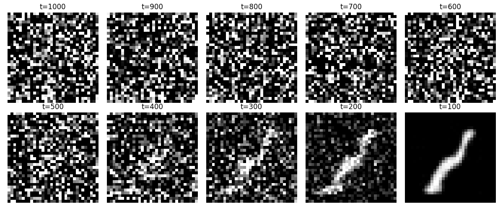
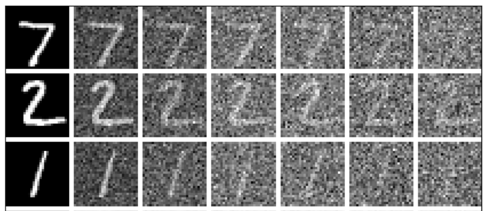
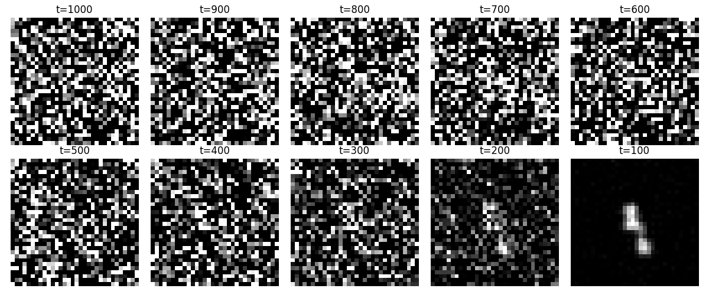
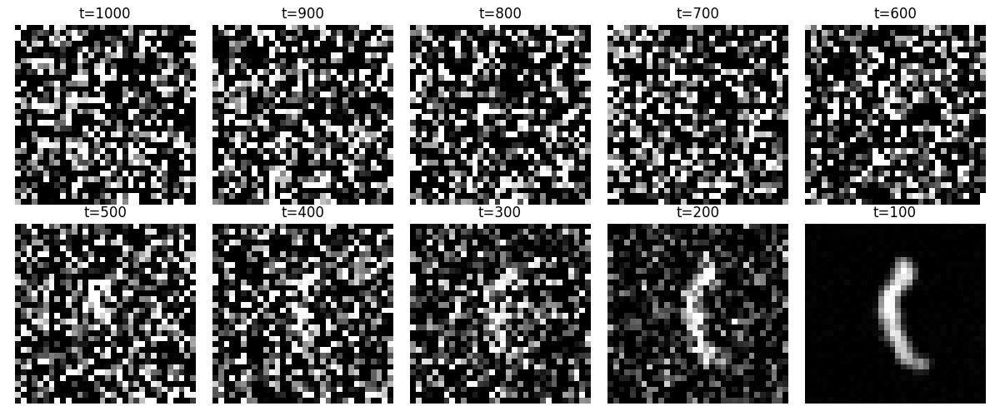

# Denoising Diffusion Probabilistic Model from Scratch on the MNIST dataset

In this repository I create a DDPM model trained on the MNIST dataset, generating random handwritten digits. 
The libraries used are:

- PyTorch, for data handling
- DeepInv for the DiffUNET CNN




The standard DDPM approach is followed based on the original DDPM paper [1]. The core idea is that for each image we add Gaussian noise over 1000 timesteps, while we train a UNET type Convolutional Neural Network to denoise the new image. The metric - loss function used in the training process is a simple MSE difference, which is derived from the KL divergence of the real noise added and the model predicted noise. 
<br>  
For the sampling process, we start with a random 32x32 image generated with Gaussian noise at timestep t=1000, and we reverse the noising process using the trained network.



More specifically:
 We start with te dataset, scale it and convert it into a tensor with size $$[batch_size, 1, 32, 32]$$. We use 1000 timesteps and values in the range $$0.0001 < β < 0.2$$. We also save the $$α$$ values calculated as $$1 - β$$, and the cummulative product of $$α$$ which we will use later. For the training, a learning rate of 0.0001 is used, and the models trains over 100 epochs. For each noising step we use this formula:
 <br> $`x_t = \sqrt{\bar{\alpha}_t} \cdot x_0 + \sqrt{1 - \bar{\alpha}_t} \cdot \epsilon`$<br>
where epsilon is the standard Gaussian noise and the whole step is independent of the previous step $x_{t-1}$.
For training, since this is a DDPM focused from scratch implementation we use ```deepinv```'s ```DiffUNet``` class:
```
# denoising model creation - simple unet implementation using deepinv library.
model = deepinv.models.DiffUNet(
    in_channels=1,       # grayscale MNIST images
    out_channels=1,      # predicting noise (same shape as input)
    pretrained=None      # we're training from scratch
).to(device)
```
For our evaluation function in each step we start with the negative log likelihood, which later using a bit of algebra includes the Kullback-Liebre Divergence of predicted and real noise added:
$`\mathcal{L}_{\text{vlb}} = \mathbb{E}_q \left[ \underbrace{D_{\text{KL}}(q(x_T | x_0) \parallel p(x_T))}_{\text{prior term}} + \sum_{t=1}^{T} \underbrace{D_{\text{KL}}(q(x_{t-1} | x_t, x_0) \parallel p_\theta(x_{t-1} | x_t))}_{\text{reconstruction terms}} - \underbrace{\log p_\theta(x_0 | x_1)}_{\text{optional decoder term}} \right]`$<br>
And with many derivations we eventually have<br>
$`\mathcal{L}_{\text{simple}} = \mathbb{E}_{x_0, \epsilon, t} \left[ \left\| \epsilon - \epsilon_\theta(x_t, t) \right\|^2 \right]`$<br>
As our loss function, where epsilon is the noise added and epsilon-theta is the predicted noise added. The full derivation can be found in [1].
Here are some sampling examples:


We can also see the denoising process for each 100 timesteps. Notice
that both outputs are the digit 1. This is because in training we only used
the first 1000 out of 60000 images and for only 5 epochs. Running 100 epochs
over 60000 32x32 images requires immense computational power. 
Despite this limitation, the DDPM generates clear images of the digit 1.

[1] [https://arxiv.org/abs/2006.11239](url)

